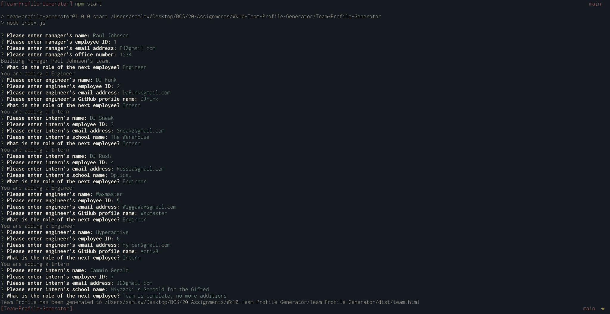

# Team Profile Generator


## Description 
Our clients requested a simple way to build a webpage listing simple information on a Manager's team of Engineers & Interns, so that they have quick access to information.

[Walkthrough Video](https://drive.google.com/file/d/1cQRbyAcQpU_t5M4_aa0lSpqrJDiRlhxR/view?usp=sharing)

[Sample Output](develop/output/README.md)


## Installation
```npm i``` will install the application along with required dependancies.

## Usage
Run ```npm start``` then follow the prompts.  The HTML Webpage is generated when user selects the "Team is complete, no more additions" option.

## Technologies
- Node.js, using inquirer & fs packages
- Bootstrap
- FontAwesome for icons

## License 
This project is licensed under 

For more information, please visit: https://opensource.org/licenses/MIT

## Tests
```npm test``` will run the appropriate Jest tests.
